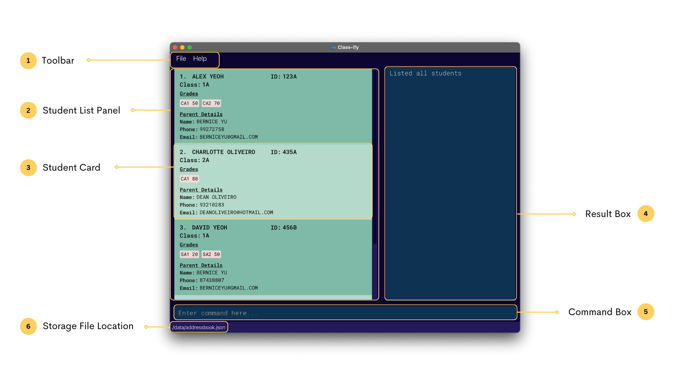
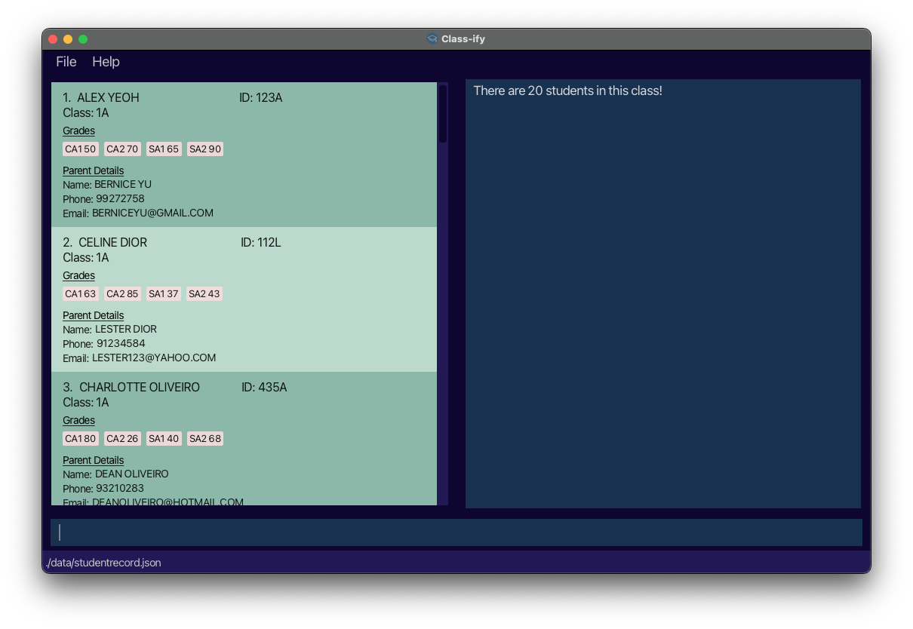
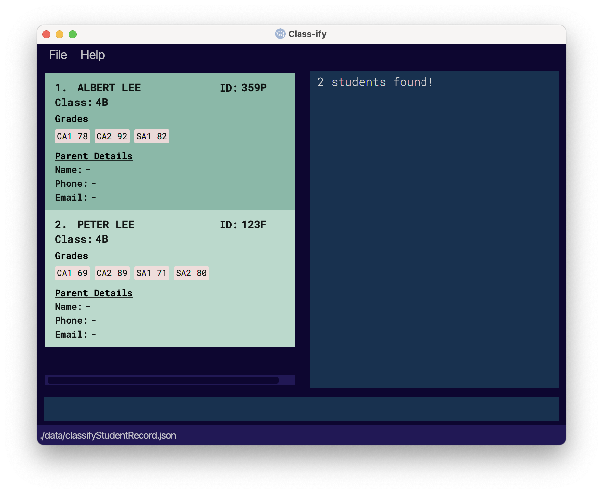
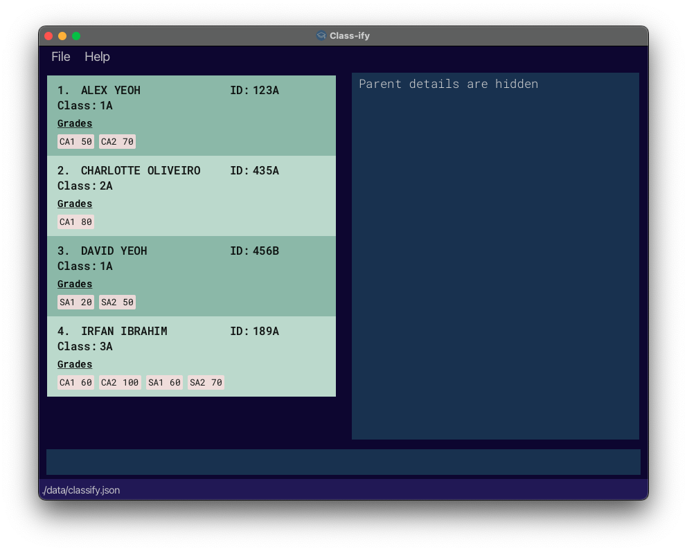
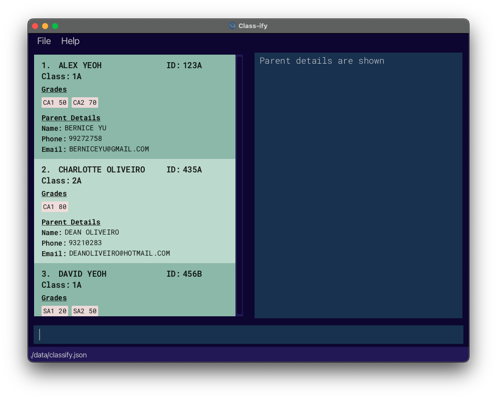
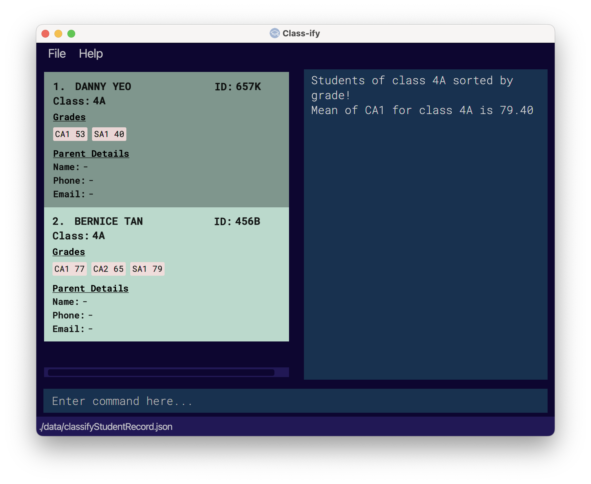
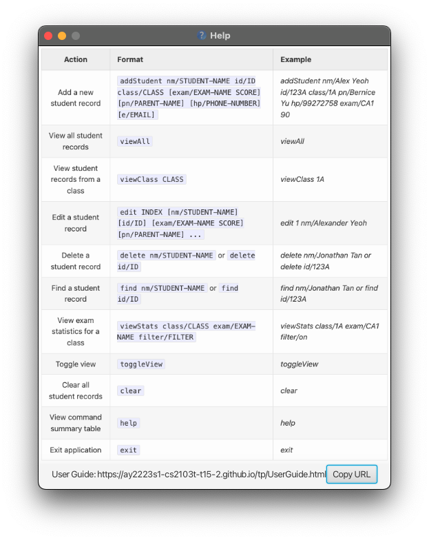

* Table of Contents
{:toc}

--------------------------------------------------------------------------------------------------------------------

## 1. **Introduction**

### 1.1 What is Class-ify

Class-ify is a **class management application** built specially for **Singapore Ministry of Education (MOE) teachers** 
to **monitor their student's academic progress easily**. Teachers can **generate exam statistics** for each class, and 
Class-ify quickly **flags out students** who require more support for contacting.

### 1.2 Who is this guide for

Are you a teacher looking to use Class-ify to manage your classes? Well, look no further! This user guide will get you 
started in no time and be your guiding light as you navigate through Class-ify's features. For a quick start guide, head
over to [Quick Start](#3-quick-start). To learn about Class-ify's features, head over to [Features](#4-features) for 
more information.

### 1.3 How to use this user guide

Class-ify uses a [Command Line Interface (CLI)](#7-glossary), which may be new to some users. If you are a new user, we strongly 
recommend you to look through the user guide from start to end to fully understand how to use Class-ify. However, you 
may also choose to skip to the relevant sections described below:

* Refer to our <a href="#top">Table of Contents</a> to easily navigate between sections of the User Guide. There is also
a link at the end of every section to bring you back to the Table of Contents.
* Refer to our [Quick Start](#3-quick-start) guide to learn how to set up Class-ify.
* Refer to our [Features](#4-features) section to learn in detail the different features and commands available in 
Class-ify.
* Refer to our [FAQ](#5-faq) for answers to frequently asked questions about how to use Class-ify.
* Refer to our [Command Summary](#6-command-summary) to have a quick overview of the different commands and their 
respective formats.
* Refer to our [Glossary](#7-glossary) to learn key terms that are used in this User Guide.

--------------------------------------------------------------------------------------------------------------------

## 2. **Class-ify's Application Window**

This section introduces the different components of Class-ify's application window and their functions. 

| No. | Component             | Description                                                                                                                    |
|-----|-----------------------|--------------------------------------------------------------------------------------------------------------------------------|
| 1   | Toolbar               | Provides convenient access to frequently used commands.                                                                        |
| 2   | Student List Panel    | Displays the list of students. You can [manage this display](#43-managing-display-of-student-records) to suit your needs.      |
| 3   | Student Card          | Displays the information of a student. The information includes the student's name, ID, class, grades, and parent details.     | 
| 4   | Result Box            | Displays the system message after the execution of a command. The system message describes the outcome of the entered command. |
| 5   | Command Box           | Type in your commands here.                                                                                                    |
| 6   | Storage File Location | Displays the location of the data file on your computer.                                                                       |

--------------------------------------------------------------------------------------------------------------------

## 3. **Quick Start**

1. Ensure you have Java 11 or above installed in your Computer.

2. Download the latest `classify.jar` [here](https://github.com/AY2223S1-CS2103T-T15-2/tp/releases).

3. Copy the file to the folder you want to use as the [home folder](#7-glossary) for Class-ify.

4. Double-click the file to start the app. The [Graphical User Interface (GUI)](#7-glossary) shown in the image below should appear in 
a few seconds. Note how the app contains some sample data. In the event that the app does not launch, click 
[here](#5-faq) for instructions on how to troubleshoot.

5. Type the command in the command box and press Enter to execute it. E.g. entering **`help`** will open the help window.

Here are some example commands you can try:

* **`addStudent`**`nm/John Doe id/928C class/1A pn/Bob Doe hp/98765432 exam/CA1 90` : Adds a new student named 
`John Doe` with his details to *Class-ify*.
* **`viewAll`** : Shows a list of all student records.
* **`delete`**`nm/Jonathan Tan` : Deletes the student record with name of student as 'Jonathan Tan'.
* **`clear`** : Clears all student records.
* **`exit`** : Exits the application.

Click <a href="#top">here</a> to return to the top.

--------------------------------------------------------------------------------------------------------------------

## 4. **Features**

Before you begin reading, here are some special notations to help you along the way.

**Tips**

Tips are useful suggestions that will help you have a better experience with Class-ify.

:bulb:
**Tip:** Tips are useful.

**Notes**

Notes are important information that you should pay attention to when using Class-ify.

:information_source:
**Note:** Take notes when you see this icon.

**Caution**

Cautions are around to warn you of potential pitfalls that new users may encounter. For example, commands like `clear`
will delete all data stored locally and this action is irreversible. You will lose your data permanently.

:exclamation:
**Caution:** Stop and read carefully when you see this!

### 4.1 Notes on the command format

:information_source:
**Note:**

* **Command Words**
  * Command words and [prefixes](#7-glossary) are case-sensitive. 
    * E.g. `eXit` will not be accepted as the `exit` command.
  * Only the last occurrence of a repeated prefix input will be taken.
    * E.g. `edit 1 nm/Jonathan nm/Ethan nm/Alice` is the same as `edit 1 nm/Alice`.

* [**Parameters**](#7-glossary)
  * Words in `UPPER_CASE` refers to input from the user.
    * E.g. For the `viewClass` command, the command format is `viewClass CLASS`. 
    `CLASS` refers to the user input which can be `viewClass 17S68`.
  * Parameters with a prefix can be written in any order.
    * E.g. `edit 1 nm/Jack id/111A` is the same as `edit 1 id/111A nm/Jack`.
  * Additional parameters for commands that do not require parameters will be ignored.
    * E.g. `exit hello123` will be accepted as the `exit` command.
  * Optional parameters are indicated by square brackets `[]`.
    * E.g. For the `addStudent` command, the command format is `addStudent nm/STUDENT-NAME id/ID class/CLASS 
    [pn/PARENT-NAME] [hp/PHONE-NUMBER] ...` 
    `[pn/PARENT-NAME]` and `[hp/PHONE-NUMBER]` refer to optional parameters that can be supplied by the user.

### 4.2 Managing student records

#### 4.2.1 Adding a new student record : `addStudent`

**Description**

Creates a new student record with the following parameters:

| **Parameter**       | **Prefix** | **Compulsory** | **Description**                                                                                                                                                                                                                                                                                                                                                                                                                                            |
|---------------------|------------|----------------|------------------------------------------------------------------------------------------------------------------------------------------------------------------------------------------------------------------------------------------------------------------------------------------------------------------------------------------------------------------------------------------------------------------------------------------------------------|
| **Name**            | `nm/`      | Yes            | Student's name should be [**alphanumeric**](#7-glossary), consisting of both letters and numbers only. As student names are treated as unique, we recommend you to use the full name of the student.  For optimal viewing, the length of the name should be **at most 17 characters**. Any longer would result in the name being cut off from the application display, though it will not affect the actual record being saved in the application. |
| **ID**              | `id/`      | Yes            | Student's id should contain **3 digits followed by 1 character** (e.g. `123A`). Do note that ids are unique, hence no two students should have the same ids.                                                                                                                                                                                                                                                                                               |
| **Class**           | `class/`   | Yes            | Class name should be **alphanumeric**, consisting of both letters and numbers only.                                                                                                                                                                                                                                                                                                                                                                        |
| **Exam**            | `exam/`    | No             | Exams should follow the format **exam name followed by score** (e.g. `CA1 90`). Current accepted exam names are _CA1_, _CA2_, _SA1_ and _SA2_. Future versions may allow custom exam or gradable items to be created.  In addition, scores should be an integer value between 0 to 100. Partial scores are currently not accepted.                                                                                                                 |
| **Parent's Name**   | `pn/`      | No             | Name of student's parent. Similar to the student's name, the parent's name should be **alphanumeric** also.                                                                                                                                                                                                                                                                                                                                                |
| **Parent's Mobile** | `hp/`      | No             | Mobile number of student's parent. It should only contain numbers, and it should be **at least 3 digits long**.  Entries with country code can be prefixed without the plus sign. For example, `+65 91234567` can be entered as `6591234567` instead.                                                                                                                                                                                              |
| **Parent's Email**  | `e/`       | No             | Email address of student's parent should follow standard convention format _local-part@domain_.                                                                                                                                                                                                                                                                                                                                                            |

:information_source:
**Note:** All fields are capitalised when saved into the application. Therefore, parameters like `nm/john` and `nm/JoHn`
are treated as _JOHN_ by default.

**Usage**

At the start of every teaching year, add in your new batch of students to Class-ify for easy tracking.

Format: `addStudent nm/STUDENT-NAME id/ID class/CLASS [exam/EXAM-NAME SCORE] [pn/PARENT-NAME] [hp/PHONE-NUMBER] 
[e/EMAIL]`

Examples:
* `addStudent nm/Peter Tan id/452B class/1F`
* `addStudent nm/Alex Yeoh id/123A class/2B exam/CA1 60 exam/CA2 70`
* `addStudent nm/John Doe id/928C class/1A pn/Bob Doe hp/98765432 e/bobdoe@gmail.com exam/CA1 50`

:bulb:
**Tip:** Optional fields can be added later using the [edit command](#414-editing-a-student-record--edit).

:bulb:
**Tip:** Multiple exams can be added in a single line. For example, `exam/CA1 50 exam/SA1 60 exam/CA1 80` will add 
grades 80 for CA1 and 60 for SA1. Notice the first score for CA1 is overridden by the second score for CA1.

:exclamation:
**Caution:** If you are receiving an invalid command message, do check to ensure that you are using the correct prefix 
for the intended parameter.

Invalid command message:
{:width="400px"}

#### 4.2.2 Editing a student record : `edit`

**Description**

Edits the respective details of an existing student.

* Edits the student at the specified `INDEX`. The index refers to the index number shown in the current displayed list. 
The index **must be a positive integer**. E.g. 1 or 2.
* Existing values will be updated to the new input values.
* Refer to the complete list of tags for each field under [`addStudent` command](#421-adding-a-new-student-record--addstudent).

**Usage**

There are three scenarios when you may need to use this command:
* When you wish to add the parent's information for a student.
* When you have completed marking the exam papers and want to add in your students' grades.
* When there is a mistake in a student record, and you wish to update it.

Format: `edit INDEX [nm/STUDENT-NAME] [id/ID] [exam/EXAM-NAME SCORE] [pn/PARENT-NAME] ...`

Examples:
* `edit 1 exam/CA2 70 exam/SA1 60` adds or updates the _CA2_ and _SA1_ exam grades of the 1st student to be _70_ and _60_ respectively.
* `edit 2 nm/Jacob Teo` edits the name of the 2nd student to _Jacob Teo_.

#### 4.2.3 Deleting a student record : `delete`

**Description**

Deletes an existing student record from the class list, using the student’s name or the student’s ID.

**Usage**

In the event that a student is no longer in your class, you may use this command to delete his/her student record from 
the list.

Format: `delete nm/STUDENT-NAME` or `delete id/ID`

Examples:
* `delete nm/Jonathan Tan` deletes student record with student name as _Jonathan Tan_.
* `delete id/123A` deletes student record with student ID as _123A_.

:information_source:
**Note:** All fields are capitalised when saved into the application. Therefore, parameters like `nm/john` and `nm/JoHn`
are treated as _JOHN_ by default.

:exclamation: **Caution:** This command will delete a student record and this action is irreversible. Make sure you are 
deleting the correct student record!

#### 4.2.4 Clearing all student records : `clear`

**Description**

Clears all student records from [local storage](#7-glossary).

**Usage**

There are two scenarios when you may need to use this command:
* When you first download Class-ify and want to delete the existing sample data.
* When you are no longer teaching any of the students in the list.

You may use this command to clear all student records and start afresh.

Format: `clear`

:exclamation: **Caution:** This command will delete all data stored locally and this action is irreversible. You will 
lose your data permanently!

### 4.3 Managing display of student records

:information_source:
   **Note:**
   The default display, when starting the application, shows all student records in Classify.
   Commands related to managing display are not saved upon exiting the application.

#### 4.3.1 Viewing all student records : `viewAll`

**Description**

Shows a list of all student records in Classify.

**Usage**

In the event that the list is only showing student records from a particular class after you have used the 
[`viewClass`](#432-viewing-student-records-from-a-class--viewclass) command below, you may use this command to display 
the full list of student records again.

Format: `viewAll`

#### 4.3.2 Viewing student records from a class : `viewClass`

**Description**

Shows a list of all students in the specified class.

**Usage**

In the event that your list contains many student records from different classes, and you wish to see student records 
from a particular class only, you may use this command to do so. The command result will also tell you how many students
are in the class.

Format: `viewClass CLASS`
* Class name can only contain alphanumeric characters.
* Class name is case-insensitive.

Example:
* `viewClass 1A` displays the list of students in _Class 1A_

#### 4.3.3 Finding a student record : `find`

**Description**

Searches for students whose name contains the specified name keywords, or whose ID matches the given ID.

**Usage**

There are a few scenarios when you may want to use this command: 
* When you are relatively unfamiliar with the class, and need to access certain information about a particular student.
* When you want to edit a student's details using the
[`edit`](https://ay2223s1-cs2103t-t15-2.github.io/tp/UserGuide.html#422-editing-a-student-record--edit) command, 
running the find command first would simplify the process.

:information_source:
**Note:** The `find` command searches through either the students' names, or the students' IDs, but not both. Therefore,
`find nm/Alice id/123A` is not a valid command. 

Format: `find nm/STUDENT-NAME` or `find id/ID`

* The search is case-insensitive. E.g _hans_ will match _Hans_.
* The search only recognises whole words, and searching for substrings is not valid. E.g. _Han_ will not match _Hans_.

Examples:
* `find nm/lee` displays the list of students with _lee_ in their name.

* `find nm/John` displays the list of students with _john_ in their name. 
* `find nm/john alice` displays the list of students whose name contain _john_, _alice_ or both.
* `find id/123A` displays the student with _123A_ as their student ID.

#### 4.3.4 Toggling view : `toggleView`

**Description**

Toggles the display between showing and hiding the students' parent details. If the current view displays the parent details, 'toggleView' will hide the parent details and vice versa.

**Usage**

There are a few scenarios when you may want to use this command:
* Toggle to hide when you have many student and want to uncluttered view of your students without their parental details.
* Toggle to show when you want to contact the parent of the student.

Format: `toggleView`

**Concise View**

**Detailed View**

:bulb:
**Tip:** The default view on every start of the application displays the students'
parent details as a reminder that these optional fields exists.   

### 4.4 Exam statistics

#### 4.4.1 Calculating exam statistics: `viewStats`

**Description**

Shows a list of students in the specified class, and displays the mean score of the specified exam for that class. If 
filter is set to _ON_, only students whose score for the specified exam falls below the mean will be displayed.

The list of students displayed will be arranged in order of ascending grades, using the grade for the specified exam.

**Usage**

Once you have updated the scores for a recent exam for all students in a particular class, you may use this command to
identify students who require additional academic support based on the exam results.

Format: `viewStats class/CLASS exam/EXAM-NAME filter/FILTER`

* Class name can only contain alphanumeric characters.
* Class name is case-insensitive.
* Exam name should be either _CA1_, _CA2_, _SA1_ or _SA2_.
* Exam name is case-insensitive.
* Filter is either _ON_ or _OFF_, and is case-insensitive.

Examples:
* `viewStats class/4A exam/SA1 filter/off` displays the mean obtained by _Class 4A_ for _SA1_, as well as the list of 
all the students in the _Class 4A_, arranged in ascending grades for _SA1_.
* `viewStats class/4A exam/CA1 filter/on` displays the mean obtained by _Class 4A_ for _CA1_, as well as the list of 
students in _Class 4A_ whose grade for _CA1_ falls below the mean, arranged in ascending grades for _CA1_.

### 4.5 Miscellaneous

#### 4.5.1 Viewing help : `help`

**Description**

Shows a summary of all the available commands.

**Usage**

In case you have forgotten how to use any of the commands in Class-ify, you may use this command to open a window that 
displays a command summary table.

Format: `help`

:bulb: **Tip:** Copy and paste the [URL](#7-glossary) into your browser to open this user guide. This user guide provides a more extensive explanation of each command.

#### 4.5.2 Exiting the application : `exit`

**Description**

Exits the application.

**Usage**

When you are done adding or updating student records, you may use this command to exit the application.

Format: `exit`

Click <a href="#top">here</a> to return to the top.

--------------------------------------------------------------------------------------------------------------------

## 5. **FAQ**

| **Question**                                              | **Response**                                                                                                                                                                                                                                                                                                                                                                                                                                                                                |
|-----------------------------------------------------------|---------------------------------------------------------------------------------------------------------------------------------------------------------------------------------------------------------------------------------------------------------------------------------------------------------------------------------------------------------------------------------------------------------------------------------------------------------------------------------------------|
| Do I need to save my data before exiting the application? | Student records are saved locally after any command that changes the data. There is no need to save manually.                                                                                                                                                                                                                                                                                                                                                                               |
| Why is Class-ify not running?                             | 1. Put the JAR file in an empty folder in which the app is allowed to create files (I.e. Do not use a [write-protected](#7-glossary) folder). 2. Open Command Prompt if you are using Windows or Terminal if you are using macOS. Run the `java -version` command to ensure you are using Java 11. Do this again even if you did this before, as your OS might have auto-updated the default Java version to a newer version. 3. Launch the jar file using the `java -jar` command. |
| Where can I locate my data file?                          | You can locate the JSON file in the path `[JAR file location]/data/classify.json`. We suggest that you **do not** edit the data file. Class-ify will discard all data and start with an empty data file at the next run if the format of the data file is invalid.                                                                                                                                                                                                                          |

:information_source:
**Note:** If the JAR file name has spaces in it, remember to surround it with double quotes. E.g. `java -jar "Name With Spaces.jar"`

Click <a href="#top">here</a> to return to the top.

--------------------------------------------------------------------------------------------------------------------

## 6. **Command Summary**

|              Action               | Format                                                                                                             | Example                                                                          |  
|:---------------------------------:|:-------------------------------------------------------------------------------------------------------------------|:---------------------------------------------------------------------------------|
|     Add a new student record      | `addStudent nm/STUDENT-NAME id/ID class/CLASS [exam/EXAM-NAME SCORE] [pn/PARENT-NAME] [hp/PHONE-NUMBER] [e/EMAIL]` | _addStudent nm/Alex Yeoh id/123A class/1A pn/Bernice Yu hp/99272758 exam/CA1 90_ |
|     View all student records      | `viewAll`                                                                                                          | _viewAll_                                                                        |
| View student records from a class | `viewClass CLASS`                                                                                                  | _viewClass 1A_                                                                   |
|       Edit a student record       | `edit INDEX [nm/STUDENT-NAME] [id/ID] [exam/EXAM-NAME SCORE] [pn/PARENT-NAME] ...`                                 | _edit 1 nm/Alexander Yeoh_                                                       |
|      Delete a student record      | `delete nm/STUDENT-NAME` or `delete id/ID`                                                                         | _delete nm/Jonathan Tan or delete id/123A_                                       |
|       Find a student record       | `find nm/STUDENT-NAME` or `find id/ID`                                                                             | _find nm/Jonathan Tan or find id/123A_                                           |
| View exam statistics for a class  | `viewStats class/CLASS exam/EXAM-NAME filter/FILTER`                                                               | _viewStats class/1A exam/CA1 filter/on_                                          |
|            Toggle view            | `toggleView`                                                                                                       | _toggleView_                                                                     |
|     Clear all student records     | `clear`                                                                                                            | _clear_                                                                          |
|    View command summary table     | `help`                                                                                                             | _help_                                                                           |
|         Exit application          | `exit`                                                                                                             | _exit_                                                                           |

Click <a href="#top">here</a> to return to the top.

--------------------------------------------------------------------------------------------------------------------

## 7. **Glossary**

* **CLI**: Command Line Interface (CLI) is a text-based User Interface (UI) used to run programs. Through the CLI, users
interact with the application by typing in text commands.
* **GUI**: Graphical User Interface (GUI) is an interface that allows the user to interact with through various visual
graphics.
* **Home folder**: The home folder refers to the folder on your device that stores the Class-ify application.
* **Prefix**: Refers to the representative input to indicate a specific type of information in Class-ify.
* **Parameter**: Refers to additional input that is provided along with the command word.
* **Alphanumeric characters**: Refers to characters made up of a combination of letters and/ or numbers.
* **Local storage**: Local storage refers to the data that is stored on your physical device.
* **Write-protected**: Refers to a system policy that prevents you from writing data to that location.
* **URL**: Uniform Resource Locators is a web address that opens up a web page when keyed into the browser.

Click <a href="#top">here</a> to return to the top.
